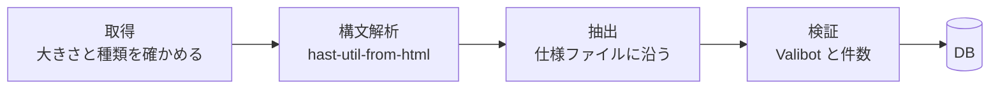

# 8. データの取得

Funmary の画面、通知、API は、DB に保存したデータだけを返します。大学のサービスなど外部への接続は、この章の定期処理だけが行います。利用者が画面を開いたり、エージェントが API を呼んだりしても、外部への接続は増えません。

## 8.1 取得元と頻度

| データ                               | 取得元                                                                                      | 頻度                                          |
| ------------------------------------ | ------------------------------------------------------------------------------------------- | --------------------------------------------- |
| 休講、補講、教室変更                 | 学生ポータルの休講情報のページ (ログインが要る)                                             | 1 日 3 回 (7 時、12 時、18 時)                |
| 科目、時間割、シラバスの内容         | 公開シラバス (ログインは要らない)                                                           | 毎日確かめ、一覧は 6 日あけて取る (週に 1 回) |
| 学期の期間、振替授業日、全学の休講日 | 大学サイトの学年暦 (PDF)。管理者が入力した値が先                                            | 月に 1 回 (1 日の 5 時)                       |
| 祝日                                 | 内閣府の祝日の CSV                                                                          | 週に 1 回 (月曜の 4 時)                       |
| 課題の締切 (HOPE)                    | 利用者が登録するカレンダーの URL。テーブルだけ用意していて、取り込みはまだありません (予定) | -                                             |

日付の時刻はすべて日本時間です。定期処理の一覧と、実行の記録は、管理画面の「取得元と実行履歴」で見られます。

## 8.2 外部への通信の決まり

通信の共通の部品は `packages/sources` にあり、ポータルと公開シラバスのどちらも、これを通します。

- 応答を待つ時間は 15 秒、読む大きさは 5 MB までにします。超えたら読むのをやめます
- 応答の種類が HTML でなければ捨てます。リダイレクトは自分でたどり、ポータルのホスト以外へは行きません
- Cookie は tough-cookie の入れ物で引き継ぎます。ログインの送信は、やり直しません
- ポータルへの接続は、定期処理だけが行います。取得の間隔は最短 60 分で、設定では縮められないようにコードに入れています。1 回の取得でするのは、ログインと 1 ページの取得だけです
- ポータルのパスワードは、運営者自身のものだけを環境変数に置きます。ほかの利用者のパスワードは、受け取りません
- User-Agent は、一般的なブラウザのものにしています。そのぶん、上の間隔と回数の制限を必ず守ります

## 8.3 ポータルからの取得

1. ログインの画面から、ASP.NET の隠しフィールドと、年度と学期の既定の選択肢を読み取る
2. 隠しフィールド、学籍番号、パスワード、年度、学期を送ってログインする
3. 同じ Cookie で、休講情報のページを取得する
4. 取得した HTML のハッシュが前回と同じなら、ここで終える
5. 表の種類 (休講、補講、教室変更) は、表の前にある見出しの `id` で見分ける。見出しの文字と、列の組み合わせでも見分けられるようにして、見出しの `id` が変わっても動くようにしている。休講コメントの冒頭にある「補講あり」「補講なし」「補講未定」も読み取る
6. 日付は月と日だけなので、年度 (4 月始まり) の範囲に収まる年を補う
7. 授業名を科目と照合する。完全一致、Unicode 正規化 (NFKC) したあとの一致、「(旧:...)」を除いた一致の順に試し、最後に類似度で照合する。類似度は、1 位が閾値を超え、2 位と十分な差があるときだけ使う。照合できなかった授業名は、管理画面に出して、手で紐付ける

## 8.4 変更の検知と、誤った通知の防止

取得した一覧を前回の内容と比べて、通知のもとになる出来事を作ります。

| 状況                                                           | 出来事   |
| -------------------------------------------------------------- | -------- |
| 新しい休講などが載った                                         | 新規     |
| 同じ授業 (種類、日付、時限、授業名が同じ) の教室などが変わった | 変更     |
| 未来の日付の項目が、2 回続けて一覧から消えた                   | 取り消し |

1 回消えただけでは、取り消しとみなしません。ポータルの一時的な不調で、誤った通知を送らないためです。取得した件数が急に減ったときは、ログインの失敗かページ構造の変更とみなし、データを更新せずに、管理者へ知らせます。

取得に失敗し続けたときは、間隔を延ばしながら (最長 6 時間) 試し直します。最後に成功してから 12 時間たつと、画面に「情報が古い」と出し、API では `/api/v1/status` の `stale` が true になります。

## 8.5 HTML の解析

ポータルや公開シラバスの HTML は、Funmary の管理の外にあります。中身は信用せず、構造が少し変わっても動き続けるように、解析を 4 段に分けています。

- **構文解析**: hast-util-from-html を使います。ブラウザと同じ WHATWG の仕様で解釈するので、閉じタグの抜けなど崩れた HTML でも、ブラウザで見たときと同じ木になります。正規表現では読みません。スクリプトは実行せず、外部の資源も読みに行きません
- **抽出**: 取り出し方は、取得元ごとの仕様ファイルに宣言します。列は位置ではなく名前で探し、列名に別名を持たせられます。知らない列が増えても無視し、必須でない列が消えたら空にして続けます。必須の列が見つからない表は、構造が変わったとみなします
- **検証**: 1 行ごとに Valibot で形を確かめ、合わない行は捨てて数を記録します。捨てた行が 2 割を超えたときは、結果全体を信用せず、DB を更新しません。URL は `https:` で、許可したホストのものだけを残します
- **画面に出すとき**: Svelte の通常の出力 (自動でエスケープされる) だけを使い、`{@html}` は使いません。外部の文字列をキーにする入れ物には、`Map` を使います

テストは、取得元ごとに、個人情報を伏せた HTML で確かめます。列の順番や余分な空白を変えた HTML でも同じ結果になること、fast-check で作った崩れた HTML を与えても、例外で落ちずに「成功」か「構造の変化」のどちらかを返すことも、確かめています。

## 8.6 祝日

内閣府の祝日の CSV を正本にします。週に 1 回、`ETag` を付けて取得し、変わったときだけ取り込みます。文字コードは Shift_JIS です。

- 取得に失敗したら、前回取り込んだ値を使い続けます
- 一度も取得できていないときのために、ビルド時に CSV をリポジトリへ同梱しています
- CSV にまだ載っていない先の年だけ、`@holiday-jp/holiday_jp` のデータを使います。推定として記録し、CSV に載ったら置き換えます
