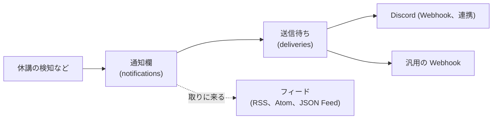

# 13. 通知

## 13.1 通知は、まず通知欄に入り、設定した送り先にも届く



通知は、すべて、まず利用者ごとの通知欄に記録します。Discord と Webhook は、利用者が有効にした送り先ごとに、送信待ちの行を作り、1 分ごとの定期処理が送ります。フィードは、RSS リーダーが取りに来たときに、通知欄の中身をそのまま返します。

- 通知欄が正本です。外部への送信に失敗しても、アプリを開くか、フィードを見れば、確認できます
- 送信待ちの行は、通知と送り先の組で 1 つだけなので、同じ通知が二重に届きません。プロセスが途中で再起動しても、未送信の分は、次の周期で送られます
- 失敗した送信は、間隔を広げながら、最大 5 回まで再送します。Webhook の削除など、再送しても直らない失敗では、送り先を止めて、通知欄で知らせます
- 利用者が、利用規約への同意を待っている間は、その人の配信は送らず、待たせておきます。同意すれば、送られます

## 13.2 通知欄

- 画面上部のベルに、未読数を出します
- `/app/notifications` に一覧を出します。種類 (休講、補講、教室変更、お知らせ) で絞り込めます
- 開くと既読になり、まとめて既読にもできます
- 各通知から、該当する授業の詳細画面へ移れます
- 90 日より古い通知は、自動で削除します

通知の種類と、既定の送り先は、次のとおりです。

| 通知                           | 送るとき     | 通知欄とフィード | Discord と Webhook |
| ------------------------------ | ------------ | ---------------- | ------------------ |
| 履修科目の休講、補講、教室変更 | 検知したとき | 常に             | 有効               |
| 連携の不具合など、お知らせ     | そのとき     | 常に             | 有効               |
| 予定のまとめ                   | 設定した時刻 | 載せない         | 設定で選ぶ         |

授業前のリマインダー、課題の締切、プッシュ通知、メールは、予定です。

## 13.3 Discord への通知

送り先は、3 つあります。

**Discord 連携 (主な送り先)**。設定の「Discord 連携」で、Discord のアカウントを連携すると、Bot が、本人だけの非公開スレッドか DM に送ります。通知の種類ごとに、送り先 (スレッド、DM、両方) と、メンションの有無を選べます。管理者が、機能全体を止められます。

**Discord の Webhook**。利用者が、自分のサーバーのチャンネルで Webhook を作り、その URL を貼ります。受け付けるのは `https://discord.com/api/webhooks/` で始まる URL だけです。登録するとテストを送ります。通知は埋め込みの形式で、休講は赤、補講は緑、教室変更は黄に色分けします。

**汎用の Webhook**。自作のスクリプトなど、ほかのサービスとの連携のために、利用者が自分で用意した `https://` の URL にも送れます。

どの Webhook も、次のように扱います。

- URL は、暗号化して保存し、画面には末尾を伏せて出し、ログには出さない
- 利用者ごとに、登録できる数の上限を置く (既定は 5 個。管理者が管理画面で変え、0 にすると、新しく登録できない)。上限を下げても、登録済みのものは消さない
- Discord が 404 を返したら、Webhook が削除されたとみなして止める。429 なら、指定された秒数を待って再送する

### 汎用の Webhook は、サーバーから任意の URL へ通信する

利用者が指定した URL に、サーバーから通信するので、サーバーの内側へ向かわせないための守りを、先に決めています。

- `https` だけを許し、ポートは 443 と 8443 だけにする
- 名前を引いた結果の IP が、ループバック、プライベート、リンクローカル、ユニークローカル、マルチキャスト、予約済みの範囲なら、送らない。判定は Node の `net.BlockList` を使う
- 検査した IP に、そのまま接続する (検査のあとに DNS が変わる、DNS リバインディングを防ぐ)。undici の `Agent` の `connect.lookup` で、検査と接続を、同じ結果にする
- リダイレクトはたどらない。応答は先頭の 64 KB だけを読み、時間は 10 秒で打ち切る
- 登録するときも、送るたびにも、同じ検査を通す

**署名**。受け取る側が、Funmary からの送信だと確かめられるよう、[Standard Webhooks](https://www.standardwebhooks.com/) に合わせて署名します。ヘッダは、`webhook-id` (通知の ID。二重の受信を見分ける)、`webhook-timestamp` (秒)、`webhook-signature` (`v1,` と、`<id>.<timestamp>.<本文>` の HMAC-SHA256 の base64) です。署名の鍵は、Webhook ごとに作り、登録した直後に 1 回だけ見せます。暗号化して保存し、作り直せます。

**中身**。通知 1 件を、1 回の POST で送ります。本人の通知だけを送り、ほかの人の授業や、管理用の情報は載せません。

```json
{
  "id": "ntf_...",
  "type": "class.cancelled",
  "createdAt": "2026-10-01T00:00:00Z",
  "data": {
    "title": "[休講] ...",
    "body": null,
    "url": "https://...",
    "subject": { "name": "...", "url": "https://..." },
    "date": "2026-10-02",
    "period": 3
  }
}
```

`title`、`body`、`url` は、通知欄や Discord の埋め込みと同じ、人が読む文面です。`subject`、`date`、`period` は、休講などの通知のときだけ持つ、機械が読める構造化データです。`type` は、通知の種類と 1 対 1 で、増やすときも、古い種類の形は変えません。この形は、OpenAPI 3.1 の `webhooks` として、公開 API の定義 (`/api/v1/openapi.json`) に含めて配っています。

## 13.4 予定のまとめ

利用者が設定すると、今日か明日の授業と予定を、Discord に 1 通にまとめて送ります。時刻は、夕方、朝、好きな時刻から選べます。授業も予定もない日に送るかも、選べます。管理者が Discord 連携を止めている間は、送りません。

## 13.5 フィード

RSS リーダーや、RSS を読める Discord、Slack のボットでも、通知を受け取れるようにします。Funmary から送る仕組みではなく、相手が取りに来る仕組みなので、送信の失敗が起きません。Discord が不調なときの受け皿にもなります。

| URL                          | 形式          | 中身         |
| ---------------------------- | ------------- | ------------ |
| `/feed/<トークン>/rss.xml`   | RSS 2.0       | 自分の通知欄 |
| `/feed/<トークン>/atom.xml`  | Atom 1.0      | 同上         |
| `/feed/<トークン>/feed.json` | JSON Feed 1.1 | 同上         |

- RSS リーダーは Cookie を送れないので、カレンダーの購読と同じく、トークン付きの URL にします。トークンは、設定の画面で、発行、再発行、無効化できます
- 載せるのは、直近 30 日で、最大 50 件です。載せる通知の種類は、設定で選べます
- 項目のタイトルは、「[休講] 情報処理演習 (10/3 2 限)」のように、種類、科目名、日付と時限を入れます。項目の ID は、通知の ID にするので、RSS リーダーで同じ項目が二重に出ません
- hono-feed の `serveFeed()` に一覧を渡すだけで、形式ごとの書式、XML のエスケープ、`ETag` と `304` を任せられます。通知が増えていなければ `304` を返し、`Cache-Control` でも、取りに来る頻度を抑えます
- 持ち主が、利用規約への同意を待っている間は、403 と説明を返します

## 13.6 管理者への通知

Funmary の不具合 (取得の失敗、構造の変化、学年暦が推定のままなど) は、管理者だけに知らせます。利用者の通知とは、別の経路です。管理用の Discord の Webhook と Bot は、利用者の送り先とは別に、環境変数で設定します。
