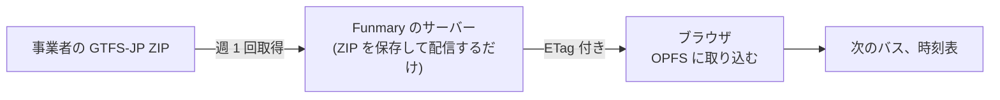

# 16. バス時刻表 (将来)

今は作りません。後から足せるように、方針だけを決めています。

## 16.1 データは GTFS-JP、処理は利用者のブラウザで行う

バスの時刻表は、事業者が公開する GTFS-JP (日本向けの公共交通データの形式) の ZIP から作ります。取得の条件と利用規約は、作るときに、あらためて調べます。取得先の URL を秘密として扱う必要があるなら、環境変数に置き、リポジトリには書きません。

読み込みには、[gtfs-jp-ts](https://github.com/Kai-Z-JP/gtfs-jp-ts) を使う予定です。ブラウザの上で、GTFS-JP の ZIP を SQLite WASM に取り込み、型のついた問い合わせができます。保存先は、ブラウザの OPFS (ページごとの永続ファイル領域) を選べます。

- サーバーは、ZIP を取得して保存し、ETag 付きで配るだけです。時刻の検索は、ブラウザの中で行うので、サーバーの負荷は、ほとんど増えません
- ブラウザは、ETag が変わったときだけ ZIP を取り直します。一度取り込めば、電波の弱い場所でも、時刻表を見られます
- 事業者のデータが更新されたら、自動で取り込み直すので、ダイヤ改正のたびに手を入れる必要はありません ([9 章](09-academic-year.md) の方針と同じ)

## 16.2 今のうちに守っておくこと

- **OPFS に必要なヘッダは、バスのページだけに付ける。** OPFS には、cross-origin isolation 用のヘッダ (COOP と COEP) が要ります。サイト全体に付けると、外部の画像などが読めなくなるので、バスのページにだけ付けます。ほかのページでは、このヘッダを前提にした作りをしません
- **重いライブラリは、バスのページでだけ読み込む。** SQLite WASM は大きいので、バスのページを開いたときに、動的に読み込みます。ほかのページの JavaScript の量には、含めません
- **サーバーの DB には、GTFS を入れない。** サーバーの DB (Drizzle) と、ブラウザの SQLite は、別物として扱います。サーバーで次のバスを通知したくなったら、そのときに、必要な表だけを取り込みます
